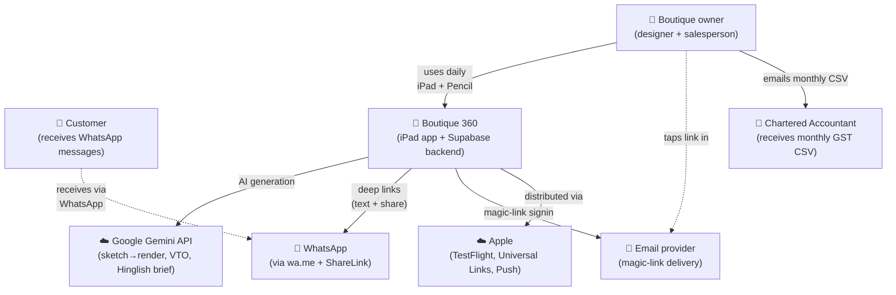
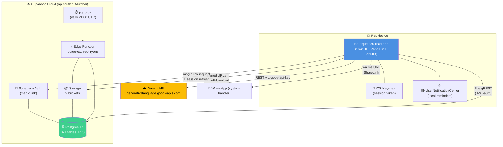
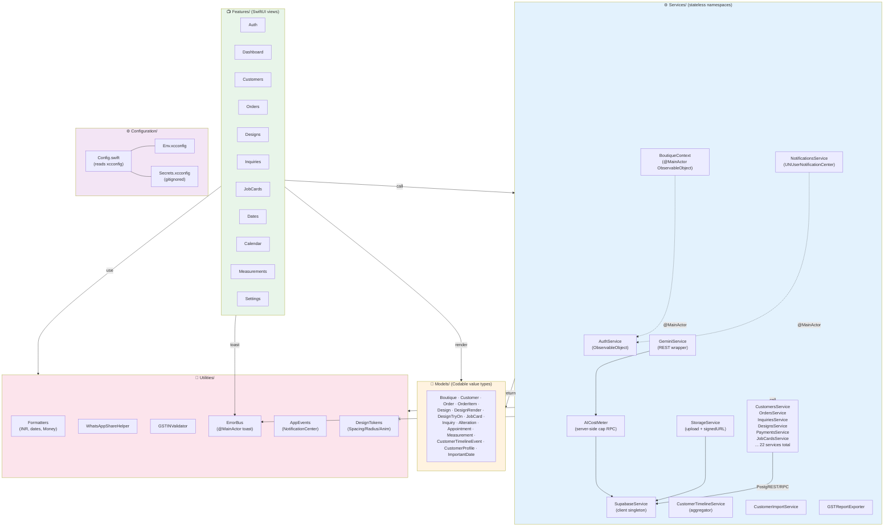
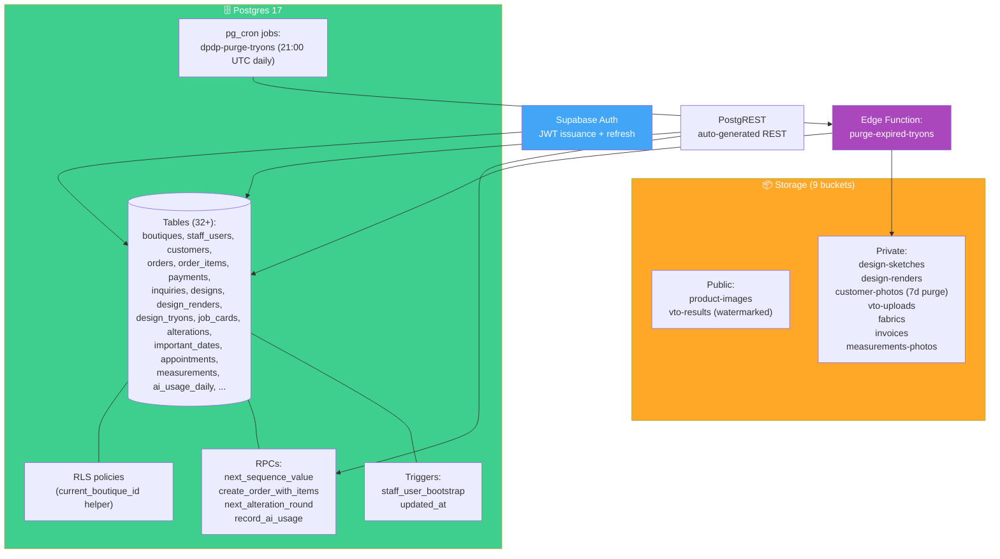
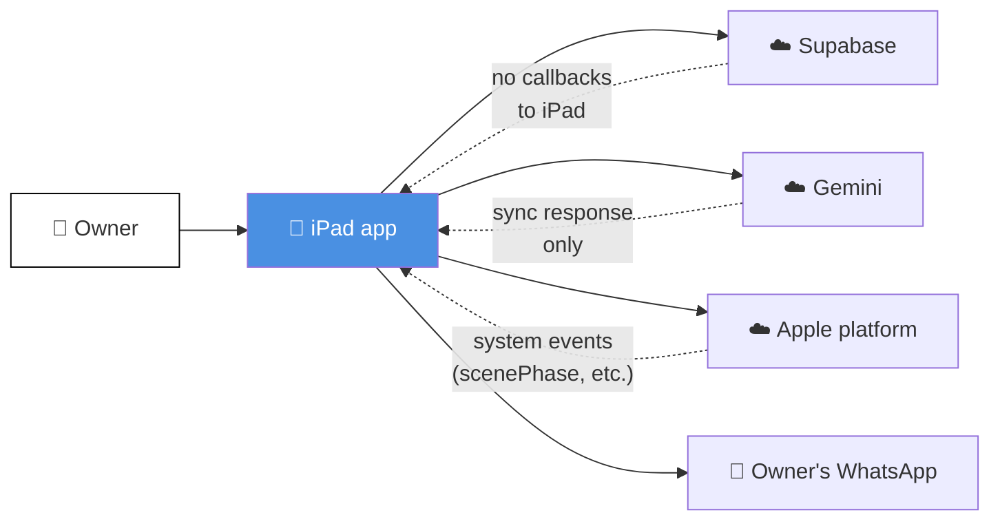

# Architecture Diagrams (C4 Model)

C4 is Simon Brown's diagramming model: System Context → Container → Component → Code. We document Levels 1-3 here; Level 4 is the Swift source itself.

All diagrams use Mermaid syntax — they render in GitHub, Notion, VS Code preview, and most Markdown viewers.

---

## Level 1 — System Context

> **Who are the users? What systems does Boutique 360 talk to at the boundary?**

**Key boundary facts:**
- Customers **never use the iPad app** — they only see WhatsApp messages the owner sends
- The CA never has app access — they only see exported CSVs
- Apple is a hard dependency (App Store / TestFlight / Universal Links)
- Magic-link email delivery is the only synchronous third-party dependency for auth

---

## Level 2 — Container

> **What are the runtime processes / data stores? Which ones depend on which?**

**Notes:**
- **Single iPad app process** — no companion macOS / iPhone surface yet
- **No backend service of our own** — everything we run is on Supabase
- **One Edge Function** today (`purge-expired-tryons`). More may come later (e.g., a weekly summary email to the owner).
- **pg_cron is the only scheduler** — keeps "what runs when" in one place (the migrations folder)
- **The iPad never talks to Apple in-app** — Apple is a deploy-time dependency (TestFlight) and OS-services (Keychain, Universal Links, notifications) only

---

## Level 3 — Component (iPad app internals)

> **What are the modules inside the iPad app? How do they relate?**

**Architecture rules (verified by grep, see `docs/architecture.md`):**
1. Views call Services. Services do not call Views.
2. Views never call `SupabaseService.client.from(...)` directly. Verified: `grep -rn "SupabaseService.client" Features/` returns **0 matches**.
3. Models import only Foundation (no SwiftUI). Verified after the M8 audit fix moved `Color` mappings out of `CustomerTimelineEvent`.
4. Utilities are leaf nodes — they don't depend on Services or Views.

---

## Level 3.5 — Component (Backend internals)

> **What are the runtime components inside Supabase?**

**Hard rules:**
- **All tables use RLS** — no table is open to anon role except `loyalty_tiers` (intentionally public reference data)
- **Every boutique-scoped query goes via `current_boutique_id()`** subquery helper (migration 0020 fixed the earlier session-GUC pattern)
- **Edge Function auth bypasses JWT** (`verify_jwt = false`) because pg_cron invokes it via service role internally; the function itself re-authenticates via `SUPABASE_SERVICE_ROLE_KEY`

---

## Level 1 (alt view) — Dependency direction

A different lens on the same system: who depends on whom?

**The iPad app is the orchestrator.** Supabase doesn't push to it (no real-time subscriptions in use yet). Gemini is request-response only. Apple's services emit OS-level events the app responds to. The owner is the only "active" party who initiates work.

When real-time becomes a requirement (e.g., multi-device sync, customer-facing notifications from the back office), arrows would flip and the system becomes bidirectional. That's a future ADR.

---

## Diagram update discipline

Whenever you add:
- **A new external service** (a third LLM, a payments provider, a CMS) → update Level 1 + 2
- **A new internal Service** → add to Level 3 list
- **A new RPC** → update Level 3.5 + `docs/api-rpcs.md`
- **A new Edge Function** → update Level 2 + 3.5

Stale diagrams are worse than missing diagrams. If you don't have time to update, file an issue + add a `// DIAGRAM TODO` comment on the relevant code.

---

## Related

- `docs/architecture.md` — prose architecture documentation (Service catalogue, design rules)
- `docs/user-flows.md` — runtime behavior sequences (orthogonal to these structural diagrams)
- `docs/adr/` — *why* the structure is shaped this way
