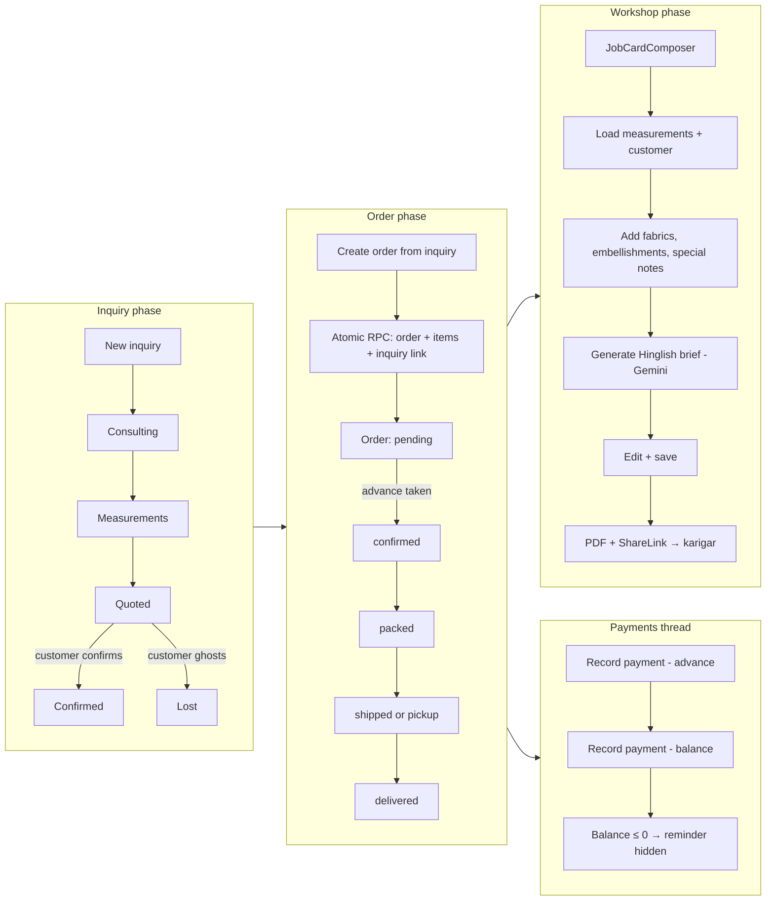
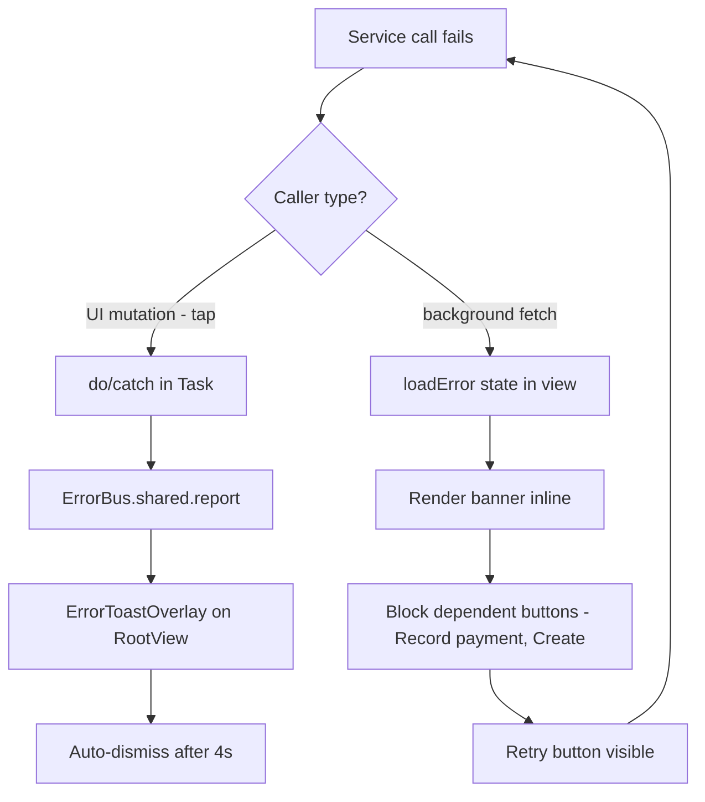
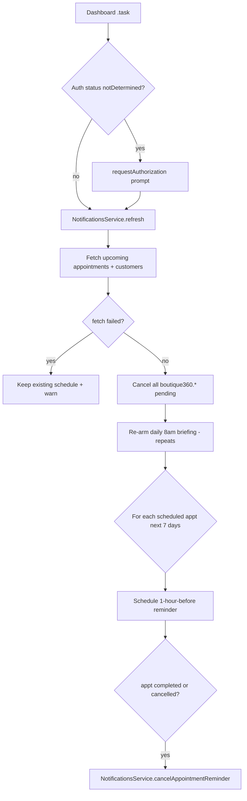
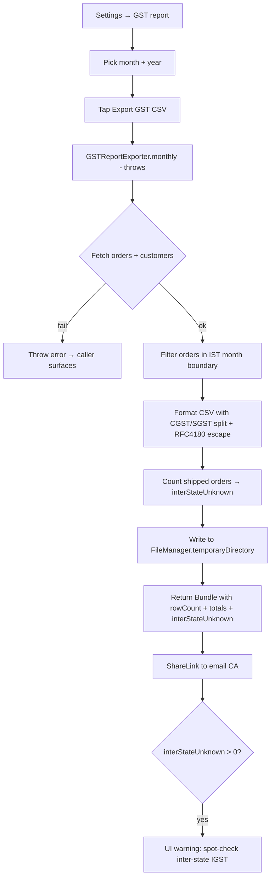
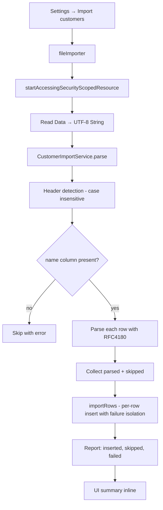

# User Flows — Boutique 360

Diagrams for the major flows. Use Mermaid; renders on GitHub, Notion, and most Markdown viewers.

---

## Flow 1 — Authentication

```mermaid
flowchart TD
    A[App launch] --> B{Session in Keychain?}
    B -->|yes| C{Session still valid?}
    B -->|no| D[SignInView]
    C -->|yes| E[BoutiqueContext.refresh]
    C -->|no - 401| D
    D --> F{Magic link or password?}
    F -->|magic link| G[Email entered → Supabase sends link]
    G --> H[Universal link callback → handleAuthCallback]
    F -->|password DEBUG only| I[demo@boutique360.test]
    H --> E
    I --> E
    E --> J{staff_users row exists?}
    J -->|yes| K[AppShellView - Dashboard]
    J -->|no| L[Trigger creates default staff row, retry]
    L --> E
```

---

## Flow 2 — Magic moment: Sketch → AI render → VTO

```mermaid
flowchart TD
    A[Customer detail] --> B[+ New design]
    B --> C[DesignFormView: name, garment, occasion, notes]
    C --> D[DesignDetailView]
    D --> E[Sketch with Pencil]
    E --> F[SketchCanvasView - PKCanvasView]
    F --> G[Save → StorageService.upload to design-sketches bucket]
    G --> H[Design row updated with sketchImagePath]
    H --> D
    D --> I[AI render]
    I --> J[RenderView]
    J --> K[Fetch sketch via signed URL]
    K --> L[GeminiService.renderGarmentFromSketch ~30s]
    L --> M[Upload result PNG to design-renders bucket]
    M --> N[Insert design_renders row with result_image_path]
    N --> O[Display result + ShareLink]
    O --> P{Customer linked?}
    P -->|yes| Q[Virtual try-on]
    Q --> R[VTO consent capture]
    R --> S{Consent toggled + signer name?}
    S -->|no| T[Disable Generate button]
    S -->|yes| U[Capture consentAt = Date()]
    U --> V[Pick customer photo]
    V --> W[GeminiService.virtualTryOn]
    W --> X[Upload customer photo + result]
    X --> Y[Insert design_tryons row with PATHS + consent timestamp]
    Y --> Z[Display watermarked result + ShareLink]
    Z --> AA[purge_at = now + 7 days]
    AA --> BB[Daily pg_cron @ 21:00 UTC]
    BB --> CC[Edge Function purge-expired-tryons]
    CC --> DD[Delete storage objects + DB row]
```

---

## Flow 3 — Inquiry → Order → Payment → Job Card



---

## Flow 4 — Status update + child section refresh

```mermaid
sequenceDiagram
    participant UI as OrderDetailView
    participant Svc as OrdersService
    participant DB as Supabase
    participant Bus as NotificationCenter
    participant Pay as PaymentsSectionView
    participant Alt as AlterationsSectionView
    participant Tl as OrderTimelineView

    UI->>Svc: updateStatus(orderId, .shipped)
    Svc->>DB: PATCH /orders?id=eq.X
    DB-->>Svc: updated row
    Svc-->>UI: Order
    UI->>UI: current = updated
    UI->>Bus: post(.orderDidChange, object: id)
    Bus-->>Pay: onReceive → await load()
    Bus-->>Alt: onReceive → await load()
    Bus-->>Tl: onReceive → await load()
```

---

## Flow 5 — Error surfacing pipeline (silent-failure fix)



---

## Flow 6 — App foreground refresh

```mermaid
sequenceDiagram
    participant iOS
    participant Root as RootView
    participant Bus as NotificationCenter
    participant Dash as DashboardView
    participant List as Various list views

    iOS->>Root: scenePhase = .active
    Root->>Bus: post(.appDidForeground)
    Bus-->>Dash: onReceive → await load()
    Bus-->>List: onReceive → await load()
    Dash->>Dash: loadFailed = false; lastRefreshAt = now
```

---

## Flow 7 — Local notifications schedule



---

## Flow 8 — DPDP-Act customer-photo lifecycle

```mermaid
flowchart LR
    A[Verbal consent in store] --> B[Owner toggles consentChecked + signer name]
    B --> C[consentAt = Date - captured BEFORE network]
    C --> D[Customer photo to customer-photos bucket]
    D --> E[Gemini VTO]
    E --> F[Result to vto-results bucket]
    F --> G[Insert design_tryons row with PATHS + consentAt + purge_at = now + 7d]
    G --> H[Result shown to owner + ShareLink]
    H --> I{saved_to_lookbook?}
    I -->|no| J[Daily 02:30 IST pg_cron]
    I -->|yes| K[Indefinite retention - owner choice]
    J --> L[Edge Function: purge-expired-tryons]
    L --> M[Delete storage objects in customer-photos + vto-results]
    M --> N[Delete DB row]
    N --> O[Audit trail: deletion timestamp in Edge logs]
```



---

## Flow 9 — GST monthly export



---

## Flow 10 — Customer CSV import



---

## Notes

- **Why mermaid**: renders inline in GitHub PRs, Notion, VS Code preview. No image generation step. Easy to maintain.
- **Update discipline**: when you change a flow's behavior, update the diagram in the same PR. Stale flow docs are worse than missing ones.
